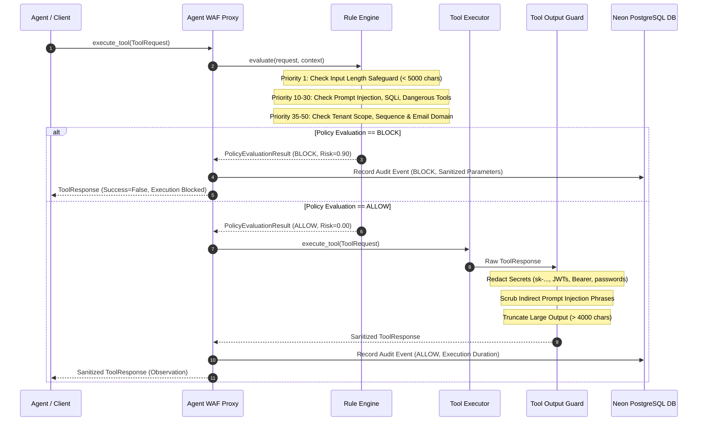
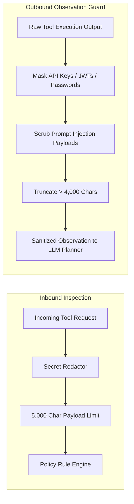
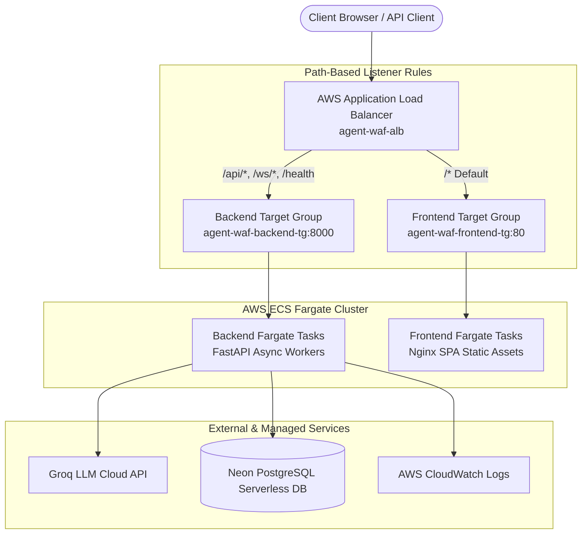

# 🛡️ Agent WAF (AI Agent Web Application Firewall)

> **Enterprise-Grade Inline Security Enforcement Proxy, Policy Engine, & Real-Time SIEM Operations Console for Autonomous LLM Agents & Tool Execution Runtimes.**


---

## 🚀 Live AWS Production Deployment

Agent WAF is live and deployed on **AWS ECS Fargate** behind an **Application Load Balancer (ALB)**!

- 🌐 **Live Load Balancer URL**: [http://agent-waf-alb-437405158.us-east-1.elb.amazonaws.com](http://agent-waf-alb-437405158.us-east-1.elb.amazonaws.com)
- 💻 **Live Console UI**: [http://agent-waf-alb-437405158.us-east-1.elb.amazonaws.com/](http://agent-waf-alb-437405158.us-east-1.elb.amazonaws.com/)
- 💚 **Backend Health Status**: [http://agent-waf-alb-437405158.us-east-1.elb.amazonaws.com/health](http://agent-waf-alb-437405158.us-east-1.elb.amazonaws.com/health) $\to$ `{"status": "healthy"}`
- 📡 **Backend API V1 Health**: [http://agent-waf-alb-437405158.us-east-1.elb.amazonaws.com/api/v1/health](http://agent-waf-alb-437405158.us-east-1.elb.amazonaws.com/api/v1/health) $\to$ `{"status": "healthy"}`

---

## 📋 Table of Contents
1. [Project Overview](#-project-overview)
2. [Key Security Value Proposition](#-key-security-value-proposition)
3. [System Architecture](#-system-architecture)
4. [Security Policy & Inspection Pipeline](#-security-policy--inspection-pipeline)
5. [Tool Output Guard & Secret Redaction](#-tool-output-guard--secret-redaction)
6. [Tech Stack](#-tech-stack)
7. [Security Rule Catalog](#-security-rule-catalog)
8. [API Reference & OpenAPI Specification](#-api-reference--openapi-specification)
9. [Local Quickstart & Development Guide](#-local-quickstart--development-guide)
10. [Docker Deployment Guide](#-docker-deployment-guide)
11. [AWS ECS Fargate Production Deployment](#-aws-ecs-fargate-production-deployment)
12. [Automated Testing & 38-Scenario Verification](#-automated-testing--38-scenario-verification)
13. [License](#-license)

---

## 💡 Project Overview

**Agent WAF** is an inline security enforcement proxy and real-time SIEM operations console engineered to inspect, evaluate, and control autonomous **AI Agent tool invocations** before execution.

As enterprises deploy autonomous LLM agents (using ReAct loops, LangChain, LangGraph, or custom agent runtimes) with access to enterprise APIs, SQL databases, and file systems, traditional perimeter web application firewalls (WAFs) fail to protect against non-HTTP, semantic AI vulnerabilities.

**Agent WAF** sits directly between the LLM Reasoning Layer (Groq LLM ReAct Planner) and enterprise tools (`SearchInvoice`, `DownloadInvoice`, `QueryOrders`, `ReadCustomer`, `SendEmail`, `GenerateReport`, etc.). Every single tool call request (`tool_name`, `parameters`) is subjected to multi-layered policy inspection before execution, guaranteeing **Fail-Closed** security, real-time risk scoring, and immutable audit logging to **PostgreSQL (Neon)**.

---

## 🚨 Key Security Value Proposition

| Vulnerability Vector | Traditional WAF Failure | Agent WAF Defense Mechanism |
| :--- | :--- | :--- |
| **Direct Prompt Injection** | Ignores natural language prompt intent inside HTTP payloads | `PromptInjectionRule` scans prompts and parameters for system override attempt patterns. |
| **Indirect Prompt Injection (IPI)**| Blind to malicious text embedded in retrieved documents/APIs | `ToolOutputGuard` inspects and scrubs prompt injection phrases from tool outputs before context injection. |
| **SQL & Command Injection** | Only scans standard web inputs; misses dynamic agent parameter queries | `SQLInjectionRule` & `DangerousToolRule` block unauthorized SQL commands and shell actions. |
| **Data Scope & Cross-Tenant Leakage** | Lacks awareness of agent session scopes and tenant claims | `DataScopeRule` validates requested `customer_id`/resource IDs against authenticated session scopes. |
| **Out-of-Order Tool Chaining** | Stateless HTTP inspection cannot detect sequence manipulation | `SequenceRule` state machine enforces mandatory prerequisite workflows (e.g. `SearchInvoice` before `DownloadInvoice`). |
| **Credential & Secret Exposure** | Plaintext logging of API keys and bearer tokens in logs | `sanitizer` automatically masks API keys, JWTs, passwords, and Bearer tokens before database write or WebSocket broadcast. |
| **ReDoS & Payload Overflows** | Large parameter payloads stall thread execution | `ParameterSizeRule` (Priority 1) enforces a 5,000-character max payload safeguard before running regex matchers. |

---

## 🏗️ System Architecture

### End-to-End Pipeline Architecture

```mermaid
flowchart TD
    subgraph User & Frontend Layer
        User([User / API Client]) -->|1. Submit Goal Prompt| Console[React Goal Execution Console]
        Console <-->|WebSocket Stream /ws/dashboard| WSManager[WebSocket Connection Manager]
    end

    subgraph Agent Reasoning Layer
        Console -->|2. POST /api/v1/agent/execute| WorkflowExec[Workflow Executor Engine]
        WorkflowExec -->|3. Get Next Tool Step| GroqPlanner[Groq LLM ReAct Planner]
        GroqPlanner -->|Fallback Failover Chain| Models[Llama 3.3 70B -> Llama 3.1 8B -> Gemma 2 9B -> Fallback Machine]
    end

    subgraph Agent WAF Security Proxy Layer
        WorkflowExec -->|4. Validate Workflow Graph| WFValidator[Workflow Validator]
        WFValidator -->|5. Intercept Tool Request| Proxy[Agent WAF Proxy Inspector]
        
        subgraph Policy Engine
            Proxy --> Evaluator[Rule Engine Policy Evaluator]
            Evaluator --> R1[RULE-SEC-PARAM-SIZE-004<br/>Payload Length Safeguard (P1)]
            Evaluator --> R2[RULE-SEC-PROMPT-INJ-001<br/>Prompt Injection Rule (P10)]
            Evaluator --> R3[RULE-SEC-SQL-INJ-002<br/>SQL Injection Rule (P20)]
            Evaluator --> R4[RULE-SEC-DANGEROUS-TOOL-003<br/>Dangerous Tool Policy (P30)]
            Evaluator --> R5[RULE-SEC-DATA-SCOPE-005<br/>Data Scope & Tenant Isolation (P35)]
            Evaluator --> R6[RULE-SEC-SEQUENCE-006<br/>Sequence Dependency Rule (P40)]
            Evaluator --> R7[RULE-SEC-CREDENTIAL-009<br/>Sensitive Credential Rule (P45)]
            Evaluator --> R8[RULE-SEC-EMAIL-008<br/>Email Policy Whitelist (P50)]
        end
        
        Evaluator -->|Compute Aggregated Risk Score| Decision{Cumulative Risk > 0.50?}
    end

    subgraph Tool Execution & Output Guard Layer
        Decision -->|BLOCK| BlockHandler[Fail-Closed Block Response]
        Decision -->|ALLOW| InnerExec[Agent Tool Executor]
        
        InnerExec --> EnterpriseTools[Enterprise Tools<br/>SearchInvoice / SendEmail / QueryOrders]
        EnterpriseTools -->|Raw Result| OutputGuard[Tool Output Guard]
        
        OutputGuard -->|Secret Redaction| Redactor[Secret Redactor]
        OutputGuard -->|IPI Scrubbing| Scrub[Prompt Injection Scrubber]
        OutputGuard -->|Length Truncation| Truncate[Max 4000 Char Truncator]
        
        Scrub -->|Sanitized Observation| WorkflowExec
    end

    subgraph Database & Telemetry Layer
        BlockHandler --> AuditLog[AuditEventPublisher]
        OutputGuard --> AuditLog
        AuditLog --> NeonDB[(Neon PostgreSQL Database)]
        AuditLog --> WSManager
    end
```

---

## 🔒 Security Policy & Inspection Pipeline

### Policy Inspection Decision Sequence



---

## 🛡️ Tool Output Guard & Secret Redaction

### Double-Sided Defense System

Agent WAF protects both **input requests** and **output observations**:



---

## 🛠️ Tech Stack

### **Backend Core Framework**
* **Language & Runtime**: Python 3.12+ with FastAPI (Async ASGI Architecture)
* **LLM Reasoning Engine**: Groq LLM ReAct Planner (`llama-3.3-70b-versatile`, `llama-3.1-8b-instant`, `gemma2-9b-it`)
* **ORM & Database Layer**: AsyncSQLAlchemy 2.0 + `asyncpg` + **PostgreSQL (Neon Serverless)**
* **Validation & Schemas**: Pydantic v2
* **Package Management**: `uv` (Fast Python dependency resolver)

### **Frontend Dashboard Console**
* **Framework**: React 18 + TypeScript + Vite
* **Real-time Telemetry**: Native WebSockets (`/ws/dashboard`)
* **Styling**: Vanilla CSS Design Tokens + Dynamic Dark Mode
* **Data Visualization**: Recharts (Risk Trend AreaCharts, EPS Gauge, Event Telemetry)

---

## 🛡️ Security Rule Catalog

| Rule ID | Rule Name | Priority | Default Risk | Action | Focus Vector |
| :--- | :--- | :---: | :---: | :---: | :--- |
| `RULE-SEC-PARAM-SIZE-004` | **Input Length Safeguard** | `1` | `0.90` | **BLOCK** | Enforces max 5,000-character payload length limit (ReDoS protection). |
| `RULE-SEC-PROMPT-INJ-001` | **Prompt Injection Detector** | `10` | `0.90` | **BLOCK** | Detects prompt override, system prompt extraction, and jailbreak patterns. |
| `RULE-SEC-SQL-INJ-002` | **SQL Injection Detector** | `20` | `0.85` | **BLOCK** | Matches raw SQL syntax (`UNION SELECT`, `DROP TABLE`, `' OR 1=1`). |
| `RULE-SEC-DANGEROUS-TOOL-003`| **Dangerous Tool Category Policy** | `30` | `0.80` | **BLOCK** | Prohibits unapproved shell, filesystem, or terminal execution tools. |
| `RULE-SEC-DATA-SCOPE-005` | **Data Scope & Tenant Isolation** | `35` | `0.80` | **BLOCK** | Restricts resource access to authorized session/tenant scope claims. |
| `RULE-SEC-SEQUENCE-006` | **Sequence Dependency Rule** | `40` | `0.75` | **BLOCK** | Enforces prerequisite tool steps (e.g. `SearchInvoice` before `DownloadInvoice`). |
| `RULE-SEC-CREDENTIAL-009` | **Sensitive Credential Protection**| `45` | `0.95` | **BLOCK** | Blocks parameter payloads containing passwords, JWTs, or private keys. |
| `RULE-SEC-EMAIL-008` | **Email Policy Whitelist Rule** | `50` | `0.85` | **BLOCK** | Restricts outbound emails to approved domains (`@enterprise.internal`, etc.). |
| `RULE-SEC-RATELIMIT-007` | **Tool Invocation Rate Limiter** | `60` | `1.00` | **BLOCK** | Sliding window rate limit per client IP / agent session. |

---

## 📚 API Reference & OpenAPI Specification

### Primary Inspection Endpoint
#### `POST /api/v1/agent/execute`
Submits a user prompt or goal for multi-step ReAct planning, workflow validation, and Agent WAF inspection.

* **Request Payload**:
```json
{
  "goal": "Find invoice INV-100, summarize it and email it to manager@enterprise.internal",
  "session_id": "session-prod-99",
  "mode": "ENFORCE"
}
```

* **Response Payload (ALLOW Decision - Completed Loop)**:
```json
{
  "workflow": "Agent Workflow: Find invoice INV-100...",
  "goal": "Find invoice INV-100, summarize it and email it to manager@enterprise.internal",
  "status": "completed",
  "session_id": "session-prod-99",
  "total_steps": 3,
  "steps": [
    {
      "step_index": 1,
      "tool": "SearchInvoice",
      "parameters": {"invoice_id": "INV-100"},
      "status": "ALLOW",
      "risk": 0.0,
      "output": {"status": "FOUND", "invoice_id": "INV-100", "amount": 4500.00}
    },
    {
      "step_index": 2,
      "tool": "GenerateSummary",
      "parameters": {"topic": "Invoice INV-100 Summary"},
      "status": "ALLOW",
      "risk": 0.0,
      "output": {"summary": "Invoice INV-100 total amount $4,500.00 for enterprise services."}
    },
    {
      "step_index": 3,
      "tool": "SendEmail",
      "parameters": {
        "recipient": "manager@enterprise.internal",
        "subject": "Invoice INV-100 Summary",
        "body": "Summary for invoice INV-100"
      },
      "status": "ALLOW",
      "risk": 0.0,
      "output": {"status": "SUCCESS", "message_id": "msg-8821"}
    }
  ],
  "final_response": "Invoice INV-100 processing completed successfully.",
  "total_execution_time_ms": 1240.5
}
```

---

## 💻 Local Quickstart & Development Guide

### **Prerequisites**
* Python 3.12+
* Node.js 18+ & npm
* `uv` package manager (`pip install uv`)

### **1. Backend Setup**
```bash
cd backend

# Create virtualenv and install dependencies
uv sync

# Copy environment settings
cp .env.example .env

# Run FastAPI backend server
uv run uvicorn app:app --reload --host 0.0.0.0 --port 8000
```

### **2. Frontend Dashboard Setup**
```bash
cd frontend

# Install dependencies
npm install

# Start Vite dev server
npm run dev
```

---

## 🐳 Docker Deployment Guide

Run the full Agent WAF platform (FastAPI Backend + React SIEM Dashboard + PostgreSQL) locally via Docker Compose:

```bash
# Build and start all services in detached mode
docker-compose up --build -d

# Verify container health probes
docker-compose ps
```

---

## ☁️ AWS ECS Fargate Production Deployment

Agent WAF is fully deployed on **AWS ECS Fargate** with multi-AZ high availability and path-based Application Load Balancer (ALB) routing.

### Architecture Topology



---

## 🧪 Automated Testing & 38-Scenario Verification

Agent WAF includes a 38-scenario security suite verifying every policy vector:

```bash
cd backend

# Execute 38-scenario security verification suite
uv run python test_suite_38.py

# Run pytest unit tests for Tool Output Guard & Secret Redaction
uv run pytest tests/test_output_guard.py
```

### Verification Results
```text
==========================================================
  FINAL 38-SCENARIO SUITE RESULTS: 38/38 PASSED (100.0%)
==========================================================
```

---

## 📄 License

Distributed under the MIT License. See `LICENSE` for details.
